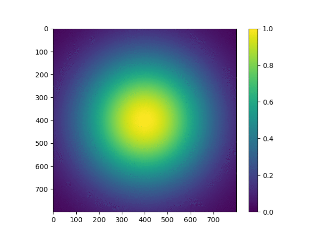

## Serial Solver with constant u,v and periodic boundaries
Seen milestone-1.

## OpenMP parallel solver
Seen milestone-2. One thing worth mentioning is that weak scaling's acceleration is bad.

## Hybrid MPI/OpenMP solver
### Build and Run Instruction
I wrote shell scripts `run.sh` and `run_all.sh` to ease everything.

`run_all.sh` will call `run.sh` and pass arguments into latter one.

This script will submit sbatch files. You could look at all the batchfiles to see what they do.

### Description of parallel strategy
The large matrix is separated into sub-matrices on different machines. 

During calculation, the border cell must be acquired from neighboring matrices by message passing provided by Open MPI.

Within each node(machine), omp can be used to spawn many threads to do the calculation like in milestone-2.

### Parallel IO
I found MPI's collective IO is not easy to use for this task. So I make every node output its own part of matrix and then use a Python script to combine them.

### Shortcomings
I didn't run benchmark without openmp, instead, I set thread to 1 to mimic the performance. 
Also, I didn't remember to use MPI_Cart_ functions, which makes programming more tough (need to explicitly calculate ranks). And to support case when there is only 1 node, I have to write if statement to make program behave differently(no more message passing). There is more generic way to do so.

I didn't fix first_order.c on only 1 node. And since I make no abstraction but bare metal rank calculation. Second_order is very diffcult in this manner. Gave up.


### Demonstration of correctness
Bitwise reproducibility should be achieved. If you look at partial matrices, you will find it true. However in post-process script, I didn't specify the presicion of scientific notation, numpy by default uses a very high precision, which makes numbers look different. But they are identical in nature.

### non-uniform u,v
Skipped. Sigh

### Movies
#### FTCS:
argument: 800 20000 1.0 1.0e6 5.0e-7 2.85e-7 500(get a shot per 500 steps)


#### First Order Upwind
First Order Upwind seems an variance of center space algorithm, where the "center space" is replaced by looking back only in one direction on that dimension. If u > 0, it uses place where the wind is from; if u < 0, it also looks against the wind. I think that's how the name `Upwind` comes from.

argument: 800 20000 1.0 1.0e6 5.0e-7 2.85e-7 1000


#### Second Order Upwind
Skipped. Bad abstraction makes it hard to achieve.

### Performance Analysis

Note that the optimal thread I choose is 32. I polished my code to make it run faster, beating some on 48 threads.

### Strong Scaling - Hybrid

```
node = 1:
Time taken in message passing: 25.51s
Time taken: 372.49s
Grind Rate: 53 step/s

node = 4:
Time taken in message passing: 17.87s
Time taken: 90.79s
Grind Rate: 220 step/s

node = 16:
Time taken in message passing: 7.28s
Time taken: 19.09s
Grind Rate: 1047 step/s

```

### Weak Scaling - Hybrid
```
node = 1:
Time taken in message passing: 30.50s
Time taken: 372.69s
Grind Rate: 53 step/s

node = 4:
Time taken in message passing: 182.74s
Time taken: 535.92s
Grind Rate: 37 step/s

node = 16:
Time taken in message passing: 500.99s
Time taken: 1192.00s
Grind Rate: 33 step/s
```

### Strong Scaling - No OMP
```


node = 4:
Time taken in message passing: 224.85s
Time taken: 1418.81s
Grind Rate: 14 step/s

node = 16
Time taken in message passing: 196.86s
Time taken: 499.08s
Grind Rate: 40 step/s

```

### Weak Scaling - No OMP
```

```


