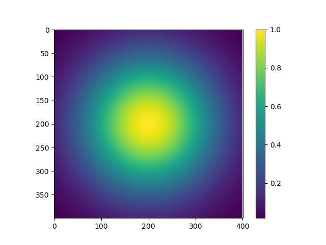
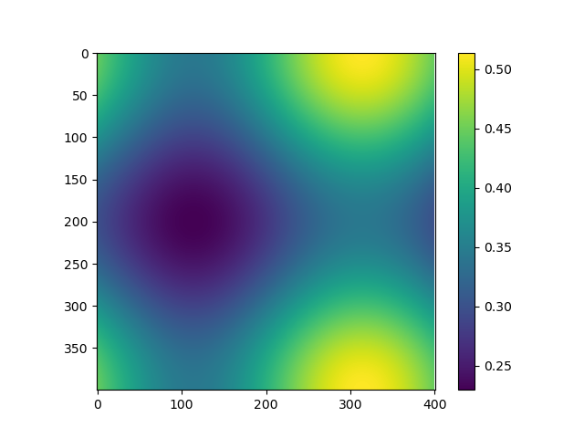

# Milestone 1 writeup for Project 1

## Build Instructions

cd into milestone-1 file folder and type

```
make
```

Then the executable 'advection' can be seen in the same folder.

## Usage

```main.cpp``` is the implementation code and ```visualize.py``` a python script to draw

Use ```./advection 400 20000 1.0 1.0e6 5.0e-7 2.85e-7``` to run the program, it will dump three matrix: "
init_matrix.csv", "halfway_matrix.csv", "final_matrix.csv".

## Results

With the given arguments, the three figures are:





I am not sure about the correctness of my implementation. It seems that the sum of energy stays consistent, so perhaps
correct.