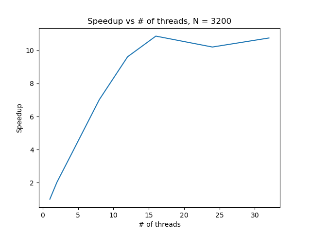
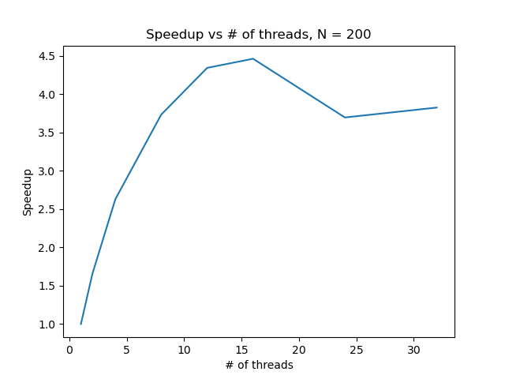
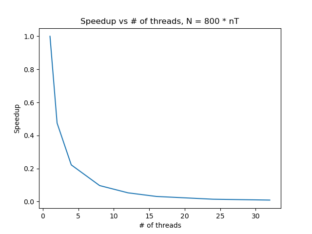

# Milestone 2 writeup for Project 1


## reproduce guide

I wrote run_benchmark.sh to automate the benchmark process.

Every datapoint is the median of Grind Rates of running three times with the same configuration. This process is also
included in the shell script.

## Environment

### Platform

```midway3```

### CPU:

```Intel(R) Xeon(R) Gold 6248R CPU @ 3.00GHz```

Note: This CPU has 96 cores, but I use 32 cores as a maximum. It seems that using too many cores will get myself kicked
out.

### OS and Compiler

OS:

uname -srm

```
Linux 4.18.0-305.19.1.el8_4.x86_64 x86_64
```

g++ --version

```
g++ (GCC) 8.4.1 20200928 (Red Hat 8.4.1-1)
```

I used optimization flag -O2.

## Parallel Strategy

The calculation part (excluding init and boundary filling) of the program has nested for loop of 3 level.

There is no point to parallel at the first (top) level, as every step relies on its previous one.

So our discretion lies in how to do within each step.

To split the workload roughly equally, I divide up the iteration by making every core compute for a portion of i's and
all of j's space, which is actually a rectangle. The OMP pragma calculates the loop bound for us implicitly!

As for scheduling, according to my test, static scheduling is faster than dynamic or guided, which may be because that
static method has the lowest overhead and all cores' workload is very similar (difference only comes from remainder).

## Correctness

I run the parallel version with 8 threads, all arguments being same with milestone-1. Then I drew the three graphs as I
did in milestone-1, they look exactly the same. Besides, I also do a `diff` between corresponding matrix's csv files,
they are bitwise identical.

Bitwise reproducibility is expected. First, the serial version is deterministic. The non-deterministic part in parallel
version is in each step, the order of these "rectangles" are computed. However, since we save the result in a new
matrix (matrix of next step, Cnn in the program), the original matrix (Cn) stays unchanged. Therefore, the order will
not affect the final result, which is consistent with the nature of the algorithm.

## Performance

### My best grind rate:

Static Scheduling and default partition

Number of processors: 32

Time taken: 295.04s

Grind Rate: 67 step/s

### Strong Scaling (N=3200):

| thread number | Grind Rate |
|---------------|------------|
| 1             | 44         |
| 2             | 89         |
| 4             | 162        |
| 8             | 309        |
| 12            | 423        |
| 16            | 478        |
| 24            | 449        |
| 32            | 473        |



### Strong Scaling (N=200):

| thread number | Grind Rate |
|---------------|------------|
| 1             | 12400      |
| 2             | 20354      |
| 4             | 32343      |
| 8             | 45925      |
| 12            | 53422      |
| 16            | 54887      |
| 24            | 45461      |
| 32            | 47047      |



### Weak Scaling (N=800 * #thread):

| thread number | Grind Rate |
|---------------|------------|
| 1             | 775        |
| 2             | 368        |
| 4             | 172        |
| 8             | 75         |
| 12            | 41         |
| 16            | 24         |
| 24            | 11         |
| 32            | 7          |

