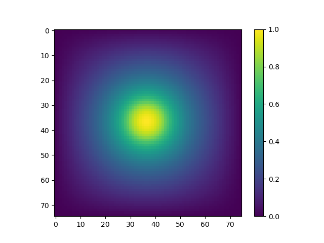
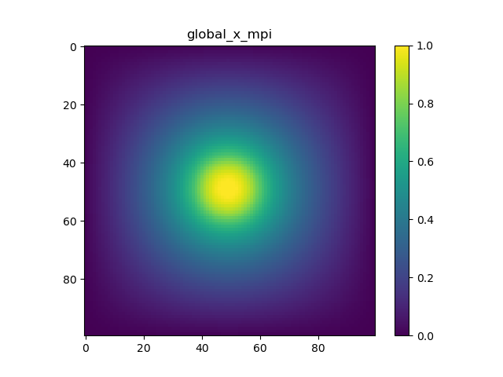
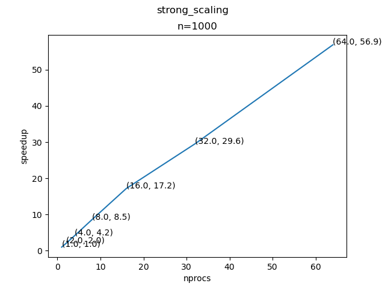
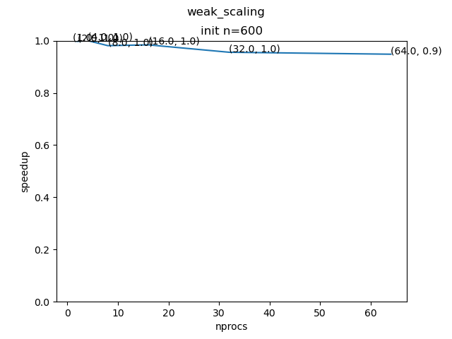

# Project 2


## Structure
To make the structure clear, I create  `cg_dense`,`cg_sparse`, and `cg_sparse_mpi` three folders. They have their own makefiles and executables.

## Milestone-1

### Build and Run Instruction

Enter `cg_dense`,`cg_sparse` to build and run them seperately.

Use `./main N` and `./main N` to run them.

Use `python draw_field.py path/to/*.out` to plot field(solution).


### Correctness

The two output matrices are bitwise identical.

### Result

```
Sparse Memory  = 0.22 MB
CG converged in 252 iterations.
Sparse Runtime = 0.03 seconds
```

Plot:


```
Dense Memory  = 241.61 MB
CG converged in 252 iterations.
Dense Runtime = 30.47 seconds
```

For a 10,000 x 10,000 physical problem, where the value of N is 10,000

Memory requirement for Dense Solver is 17592186029767.20 MB

For sparse is 3814.7 MB

## final_version

### Build and Run for MPI version
In `cg_sparse_mpi` use `./run.sh strong` or `./run.sh weak` to do strong and weak scaling test.

Note: There is a flag `save_output` in main.c in `cg_sparse_mpi` to control output resulting matrix or not

### I/O implementation

I use MPI_Gather to combine vectors and then use save_vector as given to save them.

### Idea about parallel_matvec_OTF implementation :

Similar to a leetcode problem, [i-n, i-1, i, i+1, i+n] is actually a sliding window when parallel_matvec_OTF is working.

We need to ask for left rank's last n cells and right rank's first n cells **all in once**; Then by doing some index calculations(easy for i-1 and i+1, a little bit harder for i-n and i+n), we can have the right program.

#### Details of parallel_matvec_OTF implementation:

##### 1

I assume that i - n and i+n lies their adjacent neighbors. This is a safe assumption as long as `n * n / nprocs >= n`,
which means `n >= nprocs`. Reasonable. We can assume so. 

##### 2.

How to deal with the first and last rank? They have no right and left neighbors.

No periodic boundary here! Turn off the periodic flag; then send and receive will automatically ignore non-existing boundaries.

#### 3.

Adjustment to i+1 and i-1.

```
i-1: requires (i + (Nm * rank)) % n != 0; 
i+1: requires (i + (Nm * rank)) %n != n - 1
```

Otherwise, left and right values should be 0.

### Result

When n = 100,

```
diff global_x_mpi.out ../cg_sparse/sparse.out
```

Shows that they are the same. Plots:




### Strong Scaling

One interesting thing I notice is that when `n=1000`, using openmp for thread=4 is will make running time jump from 16s
to 25s. So, I just shutdown the openmp and turn on the -O2 flag for following benchmark.

The original runtime data can be found in `strong_scaling.csv` and `weak_scaling.csv`. First column: nprocs; Second
column: runtime in second.

Plotting (n=1000):



### Weak Scaling

Yes, the number of CG iterations required to converge the problem change with problem
size. According to Kyle's idea, I normalize performace by comparing time **per iteration**.

The time complexity is `T(n) = n * n`. 

By definition of weak scaling, `T(n) / nprocs` should be constant. Then, n should be `base load * sqrt(nprocs)`, where `base load` is a constant. I have `n=600` for this problem.

Plotting (n=600 when nprocs=1):

It is surprising that the result seems super ideal after normalizing by iteration.
