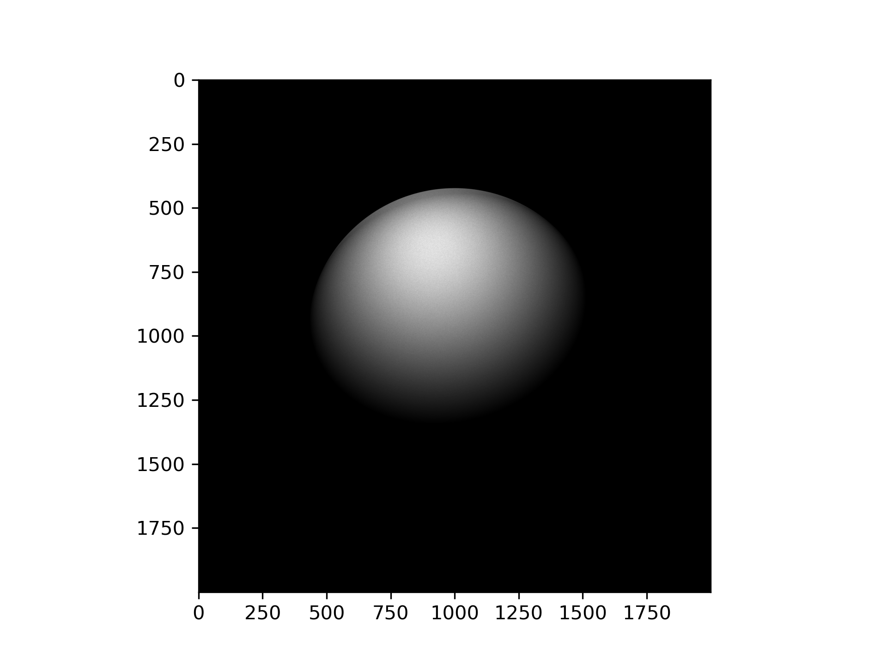

# Project 3

### Note
In Milestone1, I use C++ to wrap related methods into a Vector class.
Pointers and C++ could make CUDA development much much harder, so I re-wrote the program in C and discarded pointers. You can see both `main.c` and `main.cpp`.

### build and run
I don't have Makefiles because I put everything into `run.sh`. Otherwise, two makefiles will only have one line.

Type `./run.sh` to build and run the two programs.


### Block and Thread configurations
My stratege to determine block and thread configuration is borrowed from example: first assign NTHREADS_PER_BLOCK, then get as much block as possible (nblocks = MIN(n_ray / NTHREADS_PER_BLOCK + 1, MAX_BLOCKS_PER_DIM)). If n_ray is more than thread number, then some threads will have to handle more than one ray. This is smart because I have a structure in kernal function like `grid stride loop`

As I said on Slack, I first ran my tests on midway2 and surprisingly found that MAX_BLOCKS_PER_DIM is capped at 65535. (If I made this number of blocks larger, the output is incorrect). Then I ran my tests on midway3 and found the number is capped at 2^31 - 1;


When using 1 billion rays on midway2:
```
nblocks: 65535;  NTHREADS_PER_BLOCK: 64; avg_nrays_per_thread 238.42
time elapsed on GPU: 3.601815(s)
nblocks: 65535;  NTHREADS_PER_BLOCK: 128; avg_nrays_per_thread 119.21
time elapsed on GPU: **3.409221(s)**
nblocks: 65535;  NTHREADS_PER_BLOCK: 256; avg_nrays_per_thread 59.61
time elapsed on GPU: 3.583861(s)
nblocks: 65535;  NTHREADS_PER_BLOCK: 512; avg_nrays_per_thread 29.80
time elapsed on GPU: 3.865522(s)
nblocks: 65535;  NTHREADS_PER_BLOCK: 1024; avg_nrays_per_thread 14.90
time elapsed on GPU: 4.460602(s)
```


Well, since I use 1 billion rays, and maximum NTHREADS_PER_BLOCK is 1024 and max nblocks is 65535, every thread has more than 1 ray to compute, so nblocks always reaches its MAX.
I decide the optimal configuration is `NTHREADS_PER_BLOCK: 128`.


When using 1 billion rays on midway3 later (every thread only responsible for one ray):
```
nblocks: 15625001;  NTHREADS_PER_BLOCK: 64; avg_nrays_per_thread 1.00
time elapsed on GPU: 2.426413(s)
nblocks: 7812501;  NTHREADS_PER_BLOCK: 128; avg_nrays_per_thread 1.00
time elapsed on GPU: **2.409727(s)**
nblocks: 3906251;  NTHREADS_PER_BLOCK: 256; avg_nrays_per_thread 1.00
time elapsed on GPU: 2.435404(s)
nblocks: 1953126;  NTHREADS_PER_BLOCK: 512; avg_nrays_per_thread 1.00
time elapsed on GPU: 2.565796(s)
nblocks: 976563;  NTHREADS_PER_BLOCK: 1024; avg_nrays_per_thread 1.00
time elapsed on GPU: 2.813150(s)
```

It turns out that 128 NTHREADS_PER_BLOCK is also optimal.


### runtime contest: CPU vs GPU
I ran the CUDA program on a midway3 node with Tesla V100 GPU.

I ran the CPU on midway2 with Intel(R) Xeon(R) CPU E5-2680 v4 @ 2.40GHz CPU. (lazy to re-run on midway3 because they take a long time)

The difference is huge. Even if we use all CPU cores, still far from comparable.

|n_rays|GPU time|CPU time|
|----------|-----|--------|
|100000000 | 0.25| 72.40  |
|200000000 | 0.48| 147.25 |
|400000000 | 0.96| 288.22 |
|800000000 | 1.92| 574.98 |
|1600000000| 3.85| 1146.78|

An amazing 300x speedup!

### sample image from CUDA
resolution: 2000 * 2000; n_rays: 10 billion!


