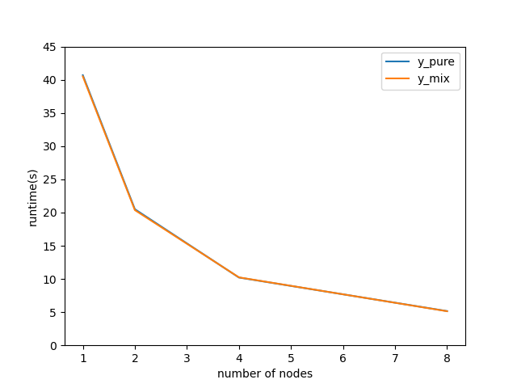

# Project 4


## Serial Version


### Note
I use my MPCS51100 code as reference. Hope this is ok.

I also make particles bounce off when they reaches the edges.
### Usage


#### Build and Run

use `make main` to build serial version and `make main_mpi` to build hybrid version.

use `./run_strong_scaling.py` to do strong scaling tests.

#### Plotting
Milestone-1:

I use `make_animation.py` to directly get an animation from `particles.dat`.

Usage:
```
python make_animation.py n_particles
```


And for production simulation, I use `plot3D.py` to get one frame per data file.


### Serial Correctness

When testing the correctness of my program, I initialized **two bodies with 0 velocity**. TFirst they were attracted closer and closer, but as they became close enough, the pull was super strong and they get accelerated to a very high speed and passed though each other! 
```
x           y       z           vx      vy      vz
-0.491498 -0.031778 0.000000 0.538119 8.825201 0.000000 
-0.491305 -0.028613 0.000000 -0.538119 -8.825201 0.000000 

5.444861 97.342499 0.000000 593.635864 9737.427734 0.000000 
-6.427663 -97.402885 0.000000 -593.635864 -9737.427734 0.000000 
```

Then I asked this question on Slack, Shobhit Verma suggested me to increase softening, which made the problem better. I got deeper understanding of softening now. It actually gives every body a pseudo "radius". However to really solve the problem a collision detection system is needed. I ... didn't not implement that.

By observing 2 bodies problem, I think the program is right. 


### Interesting Initial Conditions
100 bodies, half on left and half on right. Not sure if it's interesting haha.

Code for milestone 1 submission reflects this initial condition.


### parallelization by OMP

I check OMP version correctness by fix the random seed and use Linux's `diff` to see if the output is identical. It turned out to be the same.
##### Serial Version:

nParticles = 102400, **time per iteration: 32.1s**


##### OMP Version using all 16cores:

nParticles = 102400, **time per iteration: 5.4s**

I first use clock() for timing, I found that when I add omp, the outputting timing is much larger then wall time.

So I change time measurement to wall time. `timer.c` and `timer.h` were written by Professor if I remember correctly.


## Open MPI version

As suggested, I run OMP and MPI version on these arguments with fixed random seeds and same `init` function.
```
• Number of Timesteps = 10
• Number of Bodies = 128
• Number of Parallel MPI Ranks = 4
```
Linux `diff` shows that the output are the same!

Note that I latter omit velocity output in the file and make every step per file. And I also increase G to 100 to make pull stronger.

### Strong Scaling
```
pure MPI: 24 MPI ranks per node, 1 thread per rank
MPI + OMP: 1 MPI rank per node, 24 thread per rank
```



pure and mix's results are quite close.


### Production simulation
Kyle suggested me to output every step as a single file and use binary file to save space. I split the file by steps. This happens only in `main_mpi.c` but not in `main.c`.

I think so many bodies in a 2D plane will make the plotting too crowded. So I lift to 3D simulation.

Also, I made another plotting script for this simulation.


This production simulation video can be found here:
```
https://drive.google.com/drive/folders/1KyXtGpxedkwUIy4oUUMSsxFqZZEDGfK1?usp=sharing
```

I only did less than 300 steps because the account balance seems to be used up. Sorry for that if that causes some trouble because I am a top user. The result is not quite what I expected because all  all bodies glue together very tight; Actually only in the last few frames bodies begin to disperse. 

I'm afraid it is because I set G to 100 instead of 9.8, which makes the pull too strong.
